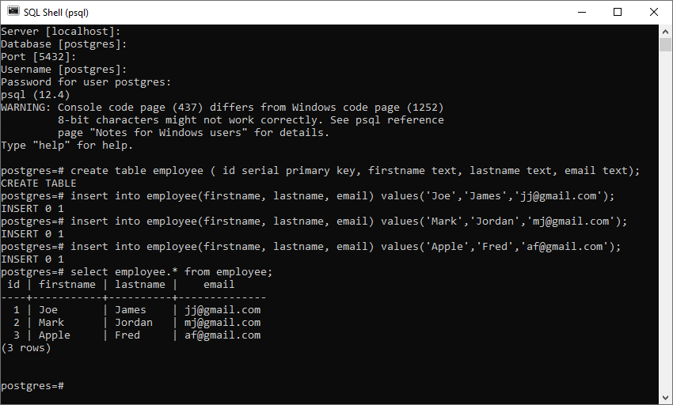

## Beginner Edition Spring Webflux using Flux and Mono in IntelliJ
This consists of an Application to perform all CRUD operation in Spring WebFlux in IntelliJ with PostgreSQL database. (Reactive Programming).

### Example 8
To perform all basic CRUD operations over a entity(table) in a database.

### Postgres Implementation
Create a table name - Employee in Postgres SQL and add a few entries to check through while executing in the localhost.

### Steps of Code Execution

  1. Clone this [repository](https://github.com/nikita9604/Beginner-Edition-Spring-Webflux-in-IntelliJ)
  2. Unzip the downloaded folder
  3. Open this in any editor with Maven support (such as IntelliJ IDEA)
  4. Connect to the postgres database as mentioned in [resources/application.properties](https://github.com/nikita9604/Beginner-Edition-Spring-Webflux-in-IntelliJ/blob/main/spring-web-example-8/src/main/resources/application.properties)
  5. Build the project and run the [SpringExample8Application.java](https://github.com/nikita9604/Beginner-Edition-Spring-Webflux-in-IntelliJ/blob/main/spring-web-example-8/src/main/java/com/nikita/springwebexample8/SpringWebExample8Application.java)
  6. Open the localhost directly as a webpage or using Postman to perform varies CRUD operations.
